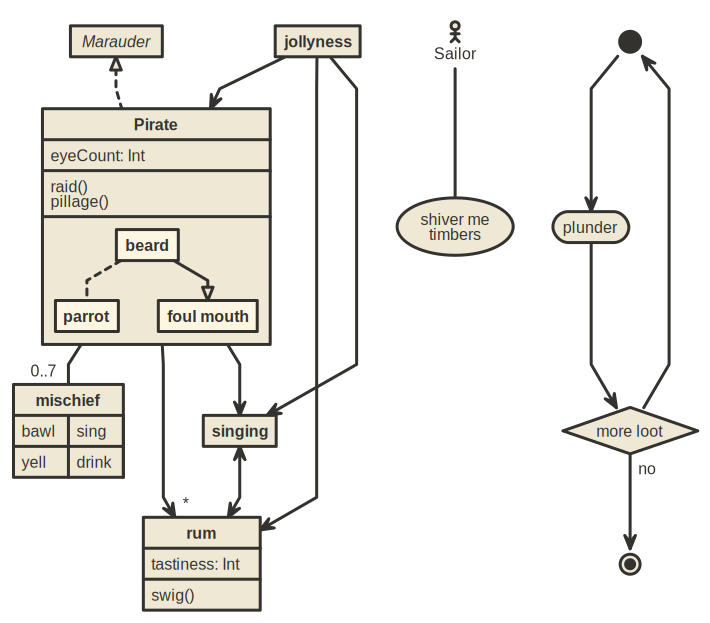

# NomnomlJS


A Julia wrapper for the [`nomnoml`](https://github.com/skanaar/nomnoml)
JavaScript library for text-based UML diagrams exportable to `svg`, `png`,
`pdf`, and `eps`. Please refer to the upstream documentation for the supported
diagram syntax.

This package is tested against Julia `1.3+` on Linux, MacOS, and Windows.

## Usage

```julia-repl
julia> ]add NomnomlJS

julia> using NomnomlJS

julia> d = Diagram("[A] is -> [B]");

julia> write("diagram.svg", d);

julia> write("diagram.png", d);

julia> d = read("diagram.noml", Diagram);

julia> write("diagram.pdf", d);

julia> write("diagram.eps", d);

```


